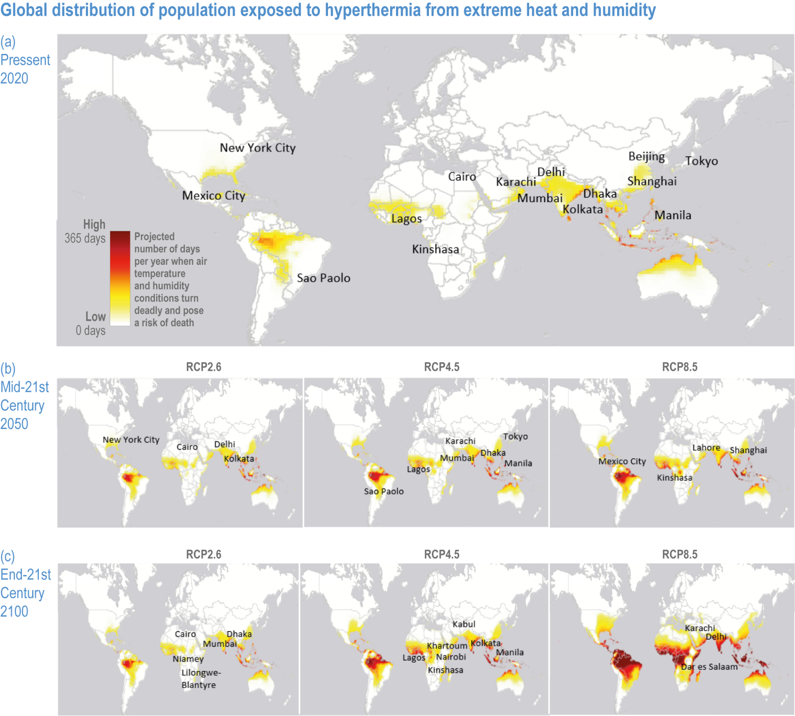
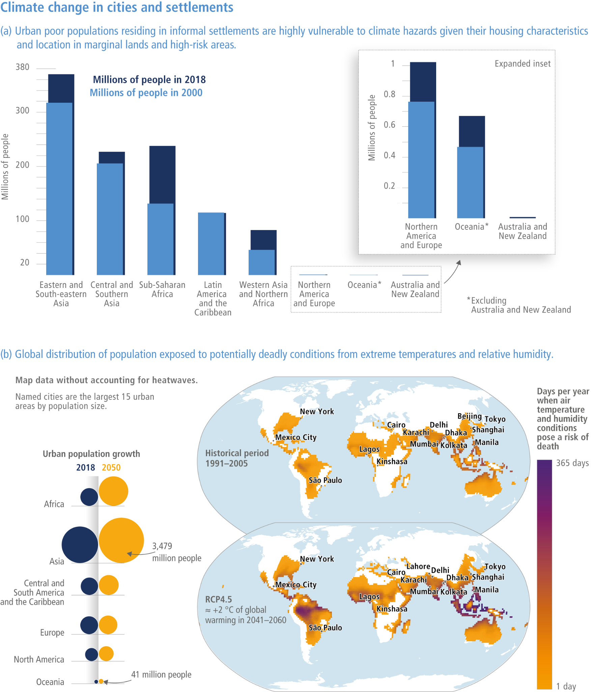
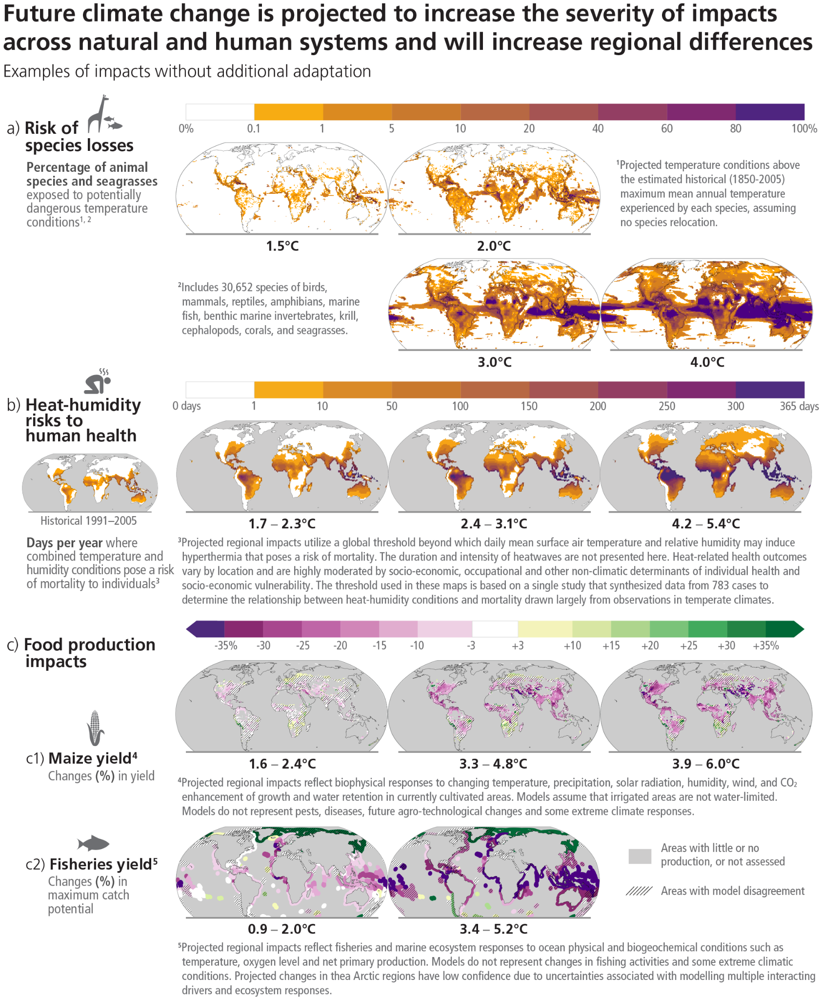

:::::::::::::::::::::::::::::::::::::: questions 

- How do figures and figure submission requirements evolve throughout the cycle ?

::::::::::::::::::::::::::::::::::::::::::::::::

::::::::::::::::::::::::::::::::::::: objectives

- Provide an overview of the figures life-cycle
- Describe evolving requirements for figure submission at the different draft versions

::::::::::::::::::::::::::::::::::::::::::::::::

## Introduction

# Evolution of reports

Figures evolve throughout the cycle. At each draft, new figures are created, some are discarded, or combined together. Some key figures prepared by chapters are highlighted in the technical summary, and later in the summary for policy makers. The audience for chapters, TS and SPM are of course differents, and figures will need to be adapted to reach those different audiences.  

For example, the figures below show how chapter figure 6.3 was converted into technical summary figure TS9, and later into SPM3. 

{alt='Chapter figure'}
{alt='TS figure'}
{alt='SPM figure'}

Once the report is adopted and published, we wish to publish the data underlying IPCC figures, so they can be reused and modified by researchers. This data publication process requires authors to provide information about each figure: who created it using what data. The following lay-out instructions to authors on how to organize figure information for submission to the TSU. Requirements are basic for the zero order draft, and increase in comprehensiveness as we move toward the Final Government Draft.  

## Zero Order Draft

At this point, figures are mostly placeholders. Authors will for example suggest that "here should be a figure showing x,y,z". There are no expectations of an actual figure being submitted at this stage. 

## First Order Draft

## Second Order Draft

## Final Government Draft

